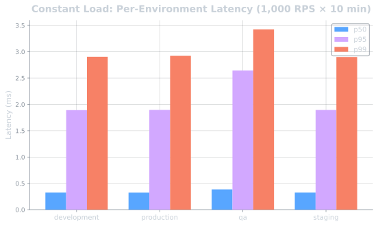
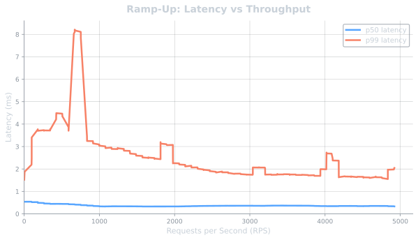
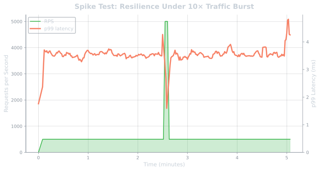
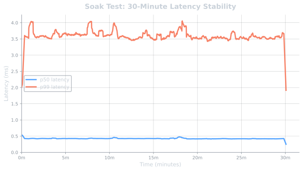
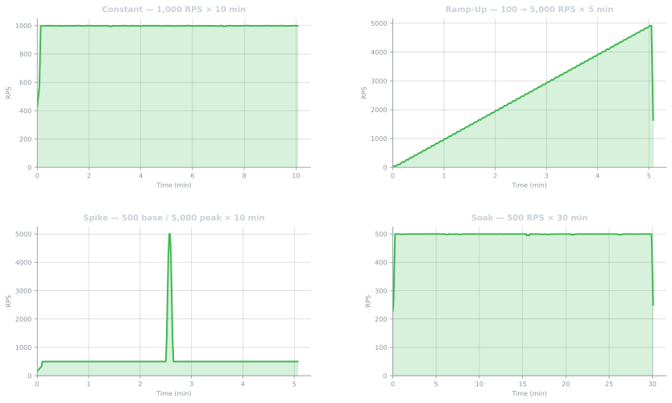

# Feature Flag Platform

A production-grade, full-stack feature flag management system — built from scratch with a polyglot architecture spanning Java, Go, TypeScript, and React. Designed for real-world scale: deterministic percentage rollouts, sub-millisecond evaluations, two-tier caching, and multi-environment support.

| Component | URL |
|-----------|-----|
| Dashboard | [feature-flag-platform.vercel.app](https://feature-flag-platform.vercel.app/dashboard) |
| Admin API | [feature-flag-0bfu.onrender.com](https://feature-flag-0bfu.onrender.com) |
| Evaluation API | [feature-flag-evaluation-api.onrender.com](https://feature-flag-evaluation-api.onrender.com) |


---

## Architecture

```
                    ┌───────────────────────────────────┐
                    │        Dashboard (Next.js)        │
                    │      React 19 · TypeScript        │
                    └─────────────────┬─────────────────┘
                                      │ REST
                                      ▼
                    ┌────────────────────────────────┐
                    │      Admin API (Java)          │
                    │    Spring Boot · JWT · OAuth2  │
                    └───────┬────────────────┬───────┘
                            │                │
                  read/write│                │ publish invalidation
                            │                │
               ┌────────────▼──┐    ┌────────▼─────────────┐
               │ PostgreSQL 16 │    │       Redis 7        │
               │ source of     │    │  L2 cache + Pub/Sub  │
               │ truth         │    │                      │
               └────────────▲──┘    └────────▲─────────────┘
                            │                │
                      query │                │ subscribe + L2 cache
                            │                │
                    ┌───────┴────────────────┴───────┐
                    │    Evaluation API (Go)         │
                    │  Read-only · Chi · Ristretto   │
                    └─────────────────▲──────────────┘
                                      │ GET /evaluate
                                      │
                    ┌─────────────────┴──────────────┐
                    │   Java SDK    ·    Node SDK    │
                    └───────────────────────────────-┘
```

---

## Performance

Stress-tested with a [custom Go benchmarking tool](benchmarking/README.md) across 4 scenarios — constant load, ramp-up, spike traffic, and 30-minute soak — hitting **2.57 million total requests** with **99.999% availability** across all runs.

> **Note:** All benchmarks were run on a single machine — the stress tester and Evaluation API running on bare metal, with PostgreSQL and Redis in Docker containers.

### Constant Load — 1,000 RPS for 10 minutes

Sustained high-throughput evaluation under steady-state conditions.

| Metric | Value |
|--------|-------|
| **Throughput** | **998 RPS** sustained (target: 1,000) |
| **Total Requests** | 598,707 |
| **Availability** | **99.999%** (3 timeouts) |
| **p50 Latency** | **0.33 ms** |
| **p95 Latency** | **2.24 ms** |
| **p99 Latency** | **3.17 ms** |
| **Mean TTFB** | 0.59 ms |
| **Data Transferred** | 285 MB @ 0.47 MB/s |



<details>
<summary><strong>Per-environment breakdown (4 environments tested concurrently)</strong></summary>

| Environment | Requests | RPS | p50 (ms) | p99 (ms) | Errors |
|-------------|----------|-----|----------|----------|--------|
| development | 150,168 | 250 | 0.32 | 2.94 | 1 |
| production | 149,297 | 249 | 0.32 | 2.93 | 1 |
| staging | 149,700 | 250 | 0.32 | 2.96 | 1 |
| qa | 149,542 | 249 | 0.38 | 3.52 | 0 |

</details>

### Ramp-Up — 100 → 5,000 RPS over 5 minutes

Linearly increasing load to find the breaking point. Peak observed: **4,919 RPS**.

| Metric | Value |
|--------|-------|
| **Peak RPS** | **4,919** |
| **Average RPS** | 2,500 |
| **Total Requests** | 749,985 |
| **Availability** | **99.999%** (6 timeouts) |
| **p50 Latency** | **0.36 ms** |
| **p95 Latency** | **1.64 ms** |
| **p99 Latency** | **3.04 ms** |
| **Mean TTFB** | 0.60 ms |
| **Data Transferred** | 357 MB @ 1.19 MB/s |



<details>
<summary><strong>Per-environment breakdown</strong></summary>

| Environment | Requests | RPS | p50 (ms) | p99 (ms) | Errors |
|-------------|----------|-----|----------|----------|--------|
| development | 187,449 | 625 | 0.34 | 2.83 | 1 |
| production | 187,379 | 625 | 0.34 | 2.83 | 2 |
| staging | 187,421 | 625 | 0.34 | 2.83 | 2 |
| qa | 187,736 | 626 | 0.41 | 3.51 | 1 |

</details>

### Spike — 500 RPS baseline, 5,000 RPS burst for 10 minutes

Simulates sudden traffic bursts (10× spike) to test system resilience.

| Metric | Value |
|--------|-------|
| **Baseline RPS** | 500 |
| **Peak RPS** | **5,001** |
| **Total Requests** | 322,495 |
| **Availability** | **99.999%** (2 timeouts) |
| **p50 Latency** | **0.42 ms** |
| **p95 Latency** | **2.71 ms** |
| **p99 Latency** | **3.73 ms** |
| **Mean TTFB** | 0.70 ms |
| **Data Transferred** | 153 MB @ 0.26 MB/s |



<details>
<summary><strong>Per-environment breakdown</strong></summary>

| Environment | Requests | RPS | p50 (ms) | p99 (ms) | Errors |
|-------------|----------|-----|----------|----------|--------|
| development | 80,517 | 134 | 0.41 | 3.55 | 0 |
| production | 80,447 | 134 | 0.41 | 3.59 | 0 |
| staging | 80,409 | 134 | 0.41 | 3.58 | 0 |
| qa | 81,122 | 135 | 0.45 | 4.08 | 2 |

</details>

### Soak — 500 RPS for 30 minutes

Extended endurance test to detect memory leaks, connection exhaustion, and latency degradation over time.

| Metric | Value |
|--------|-------|
| **Throughput** | **499 RPS** sustained for 30 minutes |
| **Total Requests** | 897,450 |
| **Availability** | **99.999%** (1 timeout) |
| **p50 Latency** | **0.44 ms** |
| **p95 Latency** | **2.90 ms** |
| **p99 Latency** | **3.90 ms** |
| **Mean TTFB** | 0.75 ms |
| **Data Transferred** | 427 MB @ 0.24 MB/s |



<details>
<summary><strong>Per-environment breakdown</strong></summary>

| Environment | Requests | RPS | p50 (ms) | p99 (ms) | Errors |
|-------------|----------|-----|----------|----------|--------|
| development | 224,238 | 125 | 0.43 | 3.70 | 0 |
| production | 224,386 | 125 | 0.43 | 3.69 | 1 |
| staging | 224,435 | 125 | 0.43 | 3.68 | 0 |
| qa | 224,391 | 125 | 0.48 | 4.32 | 0 |

</details>

### Summary

| Scenario | Duration | Total Requests | Availability | p50 (ms) | p99 (ms) | Peak RPS |
|----------|----------|----------------|--------------|----------|----------|----------|
| Constant | 10 min | 598,707 | 99.999% | 0.33 | 3.17 | 1,002 |
| Ramp-Up | 5 min | 749,985 | 99.999% | 0.36 | 3.04 | 4,919 |
| Spike | 10 min | 322,495 | 99.999% | 0.42 | 3.73 | 5,001 |
| Soak | 30 min | 897,450 | 99.999% | 0.44 | 3.90 | 501 |
| **Total** | **55 min** | **2,568,637** | **99.999%** | — | — | **5,001** |



> Benchmark config: 50 concurrent workers, 1,000-user pool, 4 environments × 9 flags, both single and bulk endpoints. Full raw results in [`benchmarking/results/`](benchmarking/results/).

---

## Modules

### Admin API — `services/admin-api/`

The control plane. A **Spring Boot 3** (Java 21) REST API that handles all CRUD operations, authentication, and authorization.

**Responsibilities:**
- User authentication (JWT + Google OAuth2)
- Role-based access control (Admin / Guest)
- CRUD for feature flags (Boolean, String, Number types)
- Environment management with API key generation
- Flag value configuration with percentage-based rollout variants
- Cache invalidation broadcasts via Redis Pub/Sub

**Key design decisions:**
- First registered user auto-promoted to Admin
- API keys scoped per-environment for isolation
- Publishes invalidation events so the Evaluation API stays in sync without polling

**Tech:** Java 21 · Spring Boot 3 · Spring Security · PostgreSQL · Redis · JWT

📖 [API Documentation →](services/admin-api/docs/README.md)

---

### Evaluation API — `services/evaluation-api/`

The data plane. A **high-performance, read-only Go API** optimized for SDK consumption. This is the hot path — every feature flag check in your app hits this service.

**Responsibilities:**
- Single flag evaluation: `GET /evaluate/{flagKey}?user={userId}`
- Bulk flag evaluation: `GET /evaluate?user={userId}`
- Deterministic percentage rollouts via MurmurHash3 consistent hashing
- Two-tier caching for sub-millisecond responses

**Caching architecture:**
```
Request → L1 Memory Cache (Ristretto, 30s TTL)
        → L2 Redis Cache (5m TTL)
        → PostgreSQL (source of truth)
```

**Key design decisions:**
- Written in Go for raw throughput — serves ~1,000 RPS with p50 of 0.33ms
- L1 cache yields sub-millisecond responses for 95-98% of requests
- Subscribes to Redis Pub/Sub for real-time cache invalidation from Admin API
- Stateless — horizontally scalable behind a load balancer

**Tech:** Go · Chi router · Ristretto (in-memory cache) · Redis · PostgreSQL

📖 [API Documentation →](services/evaluation-api/docs/README.md)

---

### Dashboard — `dashboard/`

A **Next.js 16** (React 19) admin console for managing everything through a clean UI.

**Features:**
- Create, edit, and delete feature flags with type selection (Boolean / String / Number)
- Manage environments (production, staging, dev, etc.) with API key display & regeneration
- Configure flag values per-environment with percentage-based rollout sliders
- User management with role assignment
- Google OAuth + email/password authentication
- Dark/light mode with system preference detection
- Fully responsive, mobile-friendly design

**Tech:** Next.js 16 · React 19 · TypeScript · Tailwind CSS · Radix UI · React Hook Form · Zod

📖 [Dashboard Documentation →](dashboard/docs/README.md)

---

### Java SDK — `sdk/java-sdk/`

Published to Maven Central. Drop it into any Java 21+ project and start evaluating flags.

```xml
<dependency>
    <groupId>io.github.07manan</groupId>
    <artifactId>featureflags-java-sdk</artifactId>
    <version>1.0.0</version>
</dependency>
```

**Features:**
- Type-safe evaluation: `getBooleanFlag()`, `getStringFlag()`, `getIntFlag()`, `getDoubleFlag()`
- Bulk evaluation: `getAllFlags()` for efficient multi-flag loading
- In-memory cache with configurable TTL (default 30s)
- Thread-safe with `ConcurrentHashMap` — safe for concurrent usage
- Graceful error handling — returns defaults on failure, throws on auth errors
- Builder pattern configuration

```java
FeatureFlagClient client = FeatureFlagClient.builder()
    .apiKey("ff_production_xxxxx")
    .build();

boolean enabled = client.getBooleanFlag("new-checkout", "user-123", false);
```

📖 [Java SDK Documentation →](sdk/java-sdk/README.md)

---

### Node.js SDK — `sdk/node-sdk/`

Zero-dependency SDK for Node.js 18+. Uses native `fetch`.

<!-- TODO: Update once published to npm
```bash
npm install featureflags-node-sdk
```
| Field | Value |
|-------|-------|
| Package | `featureflags-node-sdk` |
| Version | `x.x.x` |
-->

**Features:**
- Async typed getters: `getBooleanFlag()`, `getStringFlag()`, `getNumberFlag()`
- Bulk evaluation: `getAllFlags()`
- In-memory cache with configurable TTL (default 30s)
- Background cache cleanup (unreferenced timer — won't block process exit)
- Zero runtime dependencies — native `fetch` only

```ts
import { FeatureFlagClient } from "featureflags-node-sdk";

const client = new FeatureFlagClient({ apiKey: "ff_production_xxxxx" });
const darkMode = await client.getBooleanFlag("dark-mode", "user-42", false);
```

📖 [Node SDK Documentation →](sdk/node-sdk/README.md)

---

### Benchmarking Tool — `benchmarking/`

A custom CLI stress-testing tool written in Go. Auto-discovers environments, flags, and API keys from the Admin API — just provide a JWT token.

**Test modes:**
| Mode | Description |
|------|-------------|
| `constant` | Sustain fixed RPS for a duration |
| `rampup` | Linearly increase RPS over time |
| `spike` | Sudden burst traffic simulation |
| `soak` | Extended low-rate endurance test |

**Features:**
- Auto-discovery of environments, flags, and API keys
- HdrHistogram-based latency percentile tracking
- Per-environment breakdown in results
- Time-series data export (JSON)
- ANSI terminal live reporter

📖 [Benchmarking Documentation →](benchmarking/README.md)

---

## Infrastructure

| Service | Technology | Purpose |
|---------|-----------|---------|
| PostgreSQL 16 | Alpine | Primary data store for users, flags, environments, flag values |
| Redis 7 | Alpine | L2 cache + Pub/Sub for cache invalidation across instances |

Local development uses Docker Compose (`docker-compose.yml`) to spin up both databases.

---

## How Flag Evaluation Works

```
1. SDK calls:  GET /evaluate/dark-mode?user=user-123
               Header: X-API-Key: ff_production_xxxxx

2. Evaluation API:
   ├── Resolve environment from API key
   ├── Look up flag "dark-mode"
   ├── Find environment-specific flag value
   ├── If flag value has variants with percentages:
   │   ├── Hash: MurmurHash3("dark-mode:user-123") → 2847139563
   │   ├── Bucket: 2847139563 % 100 = 63
   │   └── Match bucket to variant percentage range
   └── Return evaluated value (from cache in <1ms)

3. SDK receives:
   { "flagKey": "dark-mode", "value": true, "type": "BOOLEAN" }
```

**Determinism guarantee:** Same user + same flag = same result, every time. MurmurHash3 ensures uniform distribution across buckets.

---

## Getting Started (Local Development)

```bash
# 1. Start databases
docker-compose up -d

# 2. Start Admin API (Java 21 + Maven)
cd services/admin-api
mvn spring-boot:run

# 3. Start Evaluation API (Go)
cd services/evaluation-api
go run cmd/main.go

# 4. Start Dashboard (Node.js 18+)
cd dashboard
npm install && npm run dev
```

Admin API: `http://localhost:8080` · Evaluation API: `http://localhost:8081` · Dashboard: `http://localhost:3000`

---

## Tech Stack Summary

| Layer | Technology |
|-------|-----------|
| **Frontend** | Next.js 16, React 19, TypeScript, Tailwind CSS, Radix UI |
| **Admin API** | Java 21, Spring Boot 3, Spring Security, JWT, OAuth2 |
| **Evaluation API** | Go, Chi, Ristretto, MurmurHash3 |
| **Java SDK** | Java 21, Apache HttpClient, Jackson, SLF4J |
| **Node SDK** | TypeScript, native fetch |
| **Databases** | PostgreSQL 16, Redis 7 |
| **Infra / Hosting** | Vercel, Render, Koyeb, Docker Compose |
| **Benchmarking** | Go, HdrHistogram, token-bucket rate limiter |

---

## Project Structure

```
feature-flag/
├── dashboard/              # Next.js admin dashboard
├── services/
│   ├── admin-api/          # Spring Boot control plane
│   └── evaluation-api/     # Go evaluation data plane
├── sdk/
│   ├── java-sdk/           # Published Maven SDK
│   └── node-sdk/           # Node.js SDK
├── benchmarking/           # Go stress-testing CLI
├── data/                   # Local Docker volumes (gitignored)
└── docker-compose.yml      # Local dev environment
```

---

## License

MIT
