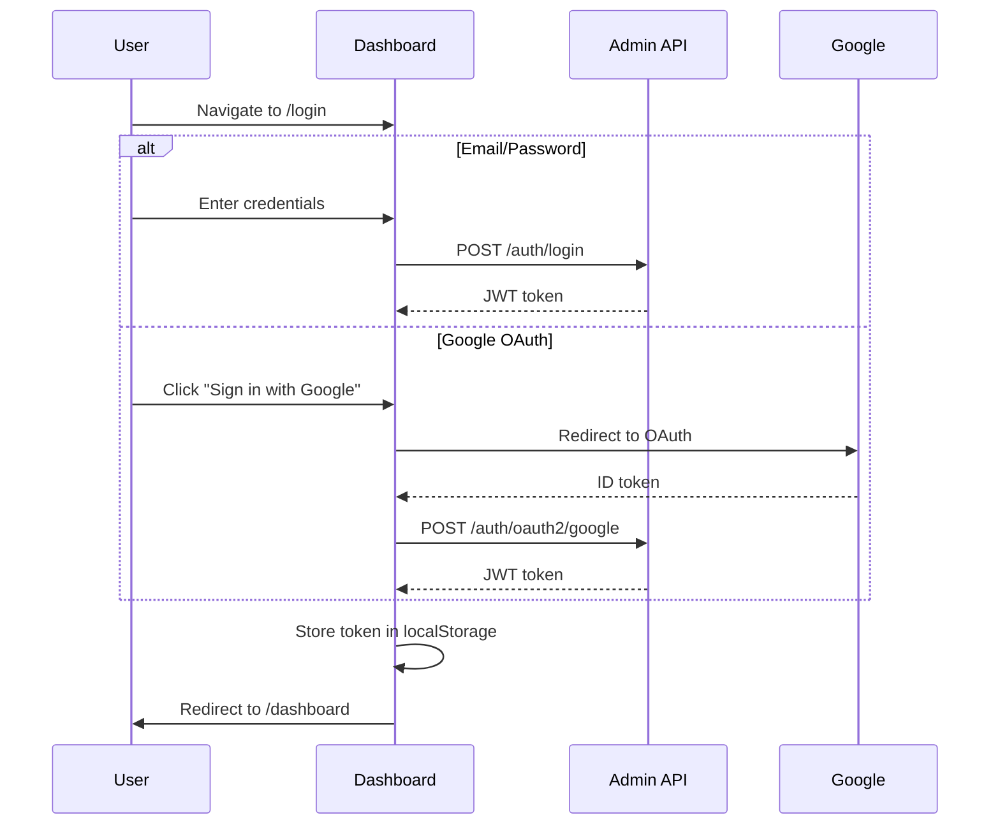

# Feature Flags Dashboard

A modern, responsive web application for managing feature flags, built with Next.js 16, React 19, and TypeScript. Provides a user-friendly interface for administrators and users to control feature rollouts across environments.

## Features

- **Modern UI/UX**: Built with Next.js App Router and Radix UI components
- **Dark/Light Mode**: Theme switcher with system preference detection
- **Authentication**: Email/password and Google OAuth support
- **Role-Based Access**: Admin and Guest role management
- **Real-Time Updates**: Optimistic UI updates with toast notifications
- **Responsive Design**: Mobile-first design with Tailwind CSS
- **Type-Safe**: Full TypeScript coverage with Zod validation
- **Protected Routes**: Authentication guards for secured pages
- **Environment Management**: Create and manage deployment environments with API keys
- **Flag Management**: CRUD operations for feature flags with different types (Boolean, String, Number)
- **Flag Values**: Set environment-specific values with percentage rollout support
- **User Management**: Manage users and their roles

## Tech Stack

| Technology | Version | Purpose |
|------------|---------|---------|
| **Next.js** | 16.1.6 | React framework with App Router |
| **React** | 19.2.3 | UI library |
| **TypeScript** | 5.9.3 | Type safety |
| **Tailwind CSS** | 4.x | Styling framework |
| **Radix UI** | Various | Accessible UI components |
| **React Hook Form** | 7.71.1 | Form handling |
| **Zod** | 4.3.6 | Schema validation |
| **Lucide React** | 0.563.0 | Icon library |
| **Next Themes** | 0.4.6 | Theme management |
| **Sonner** | 2.0.7 | Toast notifications |

## Quick Start

### Prerequisites

- Node.js 18+ and npm/yarn
- Running Admin API instance (default: `http://localhost:8080`)
- (Optional) Google OAuth credentials for social login

### Installation

```bash
# Navigate to dashboard directory
cd dashboard

# Install dependencies
npm install
```

### Configuration

Create a `.env.local` file with the following variables:

```env
# API Configuration
NEXT_PUBLIC_API_URL=http://localhost:8080

# Google OAuth (optional)
NEXT_PUBLIC_GOOGLE_CLIENT_ID=your_google_client_id
```

### Running the Application

```bash
# Development mode (with hot reload)
npm run dev

# Production build
npm run build
npm start

# Lint code
npm run lint
```

The application will be available at `http://localhost:3000`.

## Application Structure

```
dashboard/
├── app/                      # Next.js App Router
│   ├── (auth)/              # Authentication routes (public)
│   │   ├── login/           # Login page
│   │   └── register/        # Registration page
│   ├── (protected)/         # Protected routes (requires auth)
│   │   ├── dashboard/       # Main dashboard
│   │   ├── environments/    # Environment management
│   │   ├── flags/           # Flag management
│   │   ├── flag-values/     # Flag value management
│   │   └── users/           # User management
│   ├── layout.tsx           # Root layout with providers
│   └── page.tsx             # Home page (redirects)
├── components/              # React components
│   ├── auth/                # Authentication components
│   ├── environments/        # Environment CRUD components
│   ├── flags/               # Flag CRUD components
│   ├── flag-values/         # Flag value CRUD components
│   ├── navigation/          # Sidebar navigation
│   └── ui/                  # Reusable UI components (shadcn/ui)
├── context/                 # React context providers
│   ├── AuthContext.tsx      # Authentication state management
│   ├── GoogleAuthProvider.tsx # Google OAuth setup
│   └── ThemeProvider.tsx    # Theme (dark/light) management
├── hooks/                   # Custom React hooks
│   └── useRequireAuth.ts    # Authentication guard hook
├── lib/                     # Utilities and configurations
│   ├── api/                 # API client functions
│   ├── auth/                # Auth utilities (token management)
│   ├── types/               # TypeScript type definitions
│   ├── validations/         # Zod validation schemas
│   ├── config.ts            # Environment configuration
│   └── utils.ts             # Utility functions
└── public/                  # Static assets
```

## Pages & Features

| Page | Route | Description | Access |
|------|-------|-------------|--------|
| **Home** | `/` | Redirects to dashboard or login | Public |
| **Login** | `/login` | Email/password and Google OAuth login | Public |
| **Register** | `/register` | User registration with email/password | Public |
| **Dashboard** | `/dashboard` | Overview statistics (flags, environments, users) | Protected |
| **Flags** | `/flags` | Create, view, edit, and delete feature flags | Protected |
| **Environments** | `/environments` | Manage deployment environments and API keys | Protected |
| **Flag Values** | `/flag-values` | Configure environment-specific flag values | Protected |
| **Users** | `/users` | View and manage users (Admin only) | Protected (Admin) |

---

## Authentication

### Login Methods

1. **Email/Password**: Traditional authentication with JWT tokens
2. **Google OAuth**: One-click sign-in with Google account

### Authentication Flow



### Token Management

- Tokens are stored in browser localStorage
- Automatically included in API requests via `Authorization: Bearer <token>` header
- Tokens persist across page refreshes
- Logout clears the token and redirects to login

### Protected Routes

The `useRequireAuth` hook guards protected pages:

```typescript
// Automatically redirects to /login if not authenticated
const { user, loading } = useRequireAuth();
```

---

## Dashboard Overview

The main dashboard (`/dashboard`) provides a high-level overview:

- **Total Flags**: Count of all feature flags
- **Active Environments**: Number of configured environments
- **Total Users**: Count of registered users
- Quick navigation to key features

---

## Flag Management

### Creating a Flag

1. Navigate to **Flags** → **Create Flag**
2. Fill in the form:
   - **Key**: Unique identifier (e.g., `new-checkout-flow`)
   - **Name**: Human-readable name (e.g., "New Checkout Flow")
   - **Description**: Optional description
   - **Type**: Select `BOOLEAN`, `STRING`, or `NUMBER`
   - **Default Value**: Fallback value when no environment-specific value is set

### Flag Types

| Type | Description | Example Value |
|------|-------------|---------------|
| `BOOLEAN` | On/off toggle | `true`, `false` |
| `STRING` | Text value | `"blue"`, `"v2"` |
| `NUMBER` | Numeric value | `100`, `2.5` |

### Editing & Deleting Flags

- **Edit**: Click the edit icon next to a flag to modify its properties
- **Delete**: Click the delete icon and confirm (permanently removes the flag and all its values)

---

## Environment Management

### Creating an Environment

1. Navigate to **Environments** → **Create Environment**
2. Fill in the form:
   - **Key**: Unique identifier (e.g., `production`)
   - **Name**: Display name (e.g., "Production")
   - **Description**: Optional description

### API Keys

Each environment has an API key for the Evaluation API:

- **View**: Click the eye icon to reveal the full API key
- **Copy**: Click the copy button to copy to clipboard
- **Regenerate**: Click the regenerate button to generate a new key (invalidates the old one)

### Soft Delete

Deleting an environment sets `isActive=false` (soft delete) - the data is preserved but the environment is hidden.

---

## Flag Values

Flag values configure environment-specific behavior for each flag.

### Creating a Flag Value

1. Navigate to **Flag Values** → **Create Flag Value**
2. Fill in the form:
   - **Flag**: Select a feature flag
   - **Environment**: Select an environment
   - **Value**: Enter the value (must match the flag's type)
   - **Percentage**: Set rollout percentage (0-100%)

### Percentage Rollout

The rollout percentage determines what portion of users see the flag value:

- **0%**: No users see this value (flag uses default)
- **50%**: Half of users see this value (deterministic based on user ID)
- **100%**: All users see this value

The Evaluation API uses MurmurHash3 for deterministic user bucketing, ensuring consistent experiences.

### Example: Gradual Rollout

```
Flag: new-checkout-flow (BOOLEAN)
Default Value: false

Environment: Production
Value: true
Percentage: 25%

Result: 25% of users see the new checkout flow
```

---

## User Management

### Viewing Users

Navigate to **Users** to see all registered users:

- Email
- First Name
- Last Name
- Role (ADMIN or GUEST)
- Created At timestamp

### Admin-Only Access

User management is restricted to users with the `ADMIN` role. The first registered user automatically receives the ADMIN role.

---

## API Integration

The dashboard communicates with the Admin API via the API client (`/lib/api/client.ts`):

### API Client Features

- **Base URL**: Configured via `NEXT_PUBLIC_API_URL`
- **Authentication**: Automatic JWT token injection
- **Error Handling**: Centralized error handling with user-friendly messages
- **Type Safety**: Full TypeScript types for requests and responses

### API Modules

| Module | File | Purpose |
|--------|------|---------|
| Authentication | `api/auth.ts` | Login, register, OAuth |
| Flags | `api/flags.ts` | CRUD operations for flags |
| Environments | `api/environments.ts` | CRUD operations for environments |
| Flag Values | `api/flag-values.ts` | CRUD operations for flag values |

### Example API Call

```typescript
import { flagsApi } from "@/lib/api/flags";

const flags = await flagsApi.getAll();
const newFlag = await flagsApi.create({
  key: "new-feature",
  name: "New Feature",
  type: "BOOLEAN",
  defaultValue: "false"
});
```

---

## Form Validation

All forms use React Hook Form with Zod validation schemas:

### Validation Features

- **Real-time validation**: Errors shown as user types
- **Field-level errors**: Specific error messages per field
- **Type safety**: Zod schemas ensure type correctness
- **Server-side errors**: API errors displayed in the form

### Example Validation Schema

```typescript
// From /lib/validations/flags.ts
export const flagSchema = z.object({
  key: z.string().min(1, "Key is required"),
  name: z.string().min(1, "Name is required"),
  description: z.string().optional(),
  type: z.enum(["BOOLEAN", "STRING", "NUMBER"]),
  defaultValue: z.string().min(1, "Default value is required")
});
```

---

## UI Components

The dashboard uses shadcn/ui components built on Radix UI:

### Component Library

| Component | Usage |
|-----------|-------|
| `Button` | Primary actions, form submissions |
| `Input` | Text input fields |
| `Select` | Dropdown selections |
| `Dialog` | Modal windows for forms |
| `AlertDialog` | Confirmation dialogs (delete actions) |
| `Table` | Data tables (flags, environments, users) |
| `Form` | Form container with validation |
| `Card` | Content containers |
| `Badge` | Status indicators |
| `Sonner` | Toast notifications |

### Theming

- **Light/Dark Mode**: Toggle in the sidebar footer
- **System Preference**: Auto-detects OS theme preference
- **Persistent**: Theme choice saved to localStorage
- **Smooth Transitions**: Animated theme switching

---

## Error Handling

### Client-Side Errors

- **Form Validation**: Inline error messages below fields
- **API Errors**: Toast notifications with error details
- **Missing Config**: Console warnings for missing environment variables

### Error Display

```typescript
// Toast notification for API errors
toast.error("Failed to create flag", {
  description: error.message
});

// Form field error
<FormMessage>{errors.key?.message}</FormMessage>
```

---

## Development Best Practices

### Code Organization

- **Separation of Concerns**: Components, API logic, and validation separated
- **Reusable Components**: Shared UI components in `/components/ui`
- **Type Safety**: TypeScript everywhere with strict mode
- **Consistent Naming**: PascalCase for components, camelCase for functions

### State Management

- **React Context**: Global state (auth, theme)
- **Component State**: Local state with `useState`
- **Form State**: React Hook Form for form data
- **No Global Store**: Lightweight state management without Redux

### Performance

- **Server Components**: Default to Server Components where possible
- **Client Components**: Only when needed (interactivity, hooks)
- **Code Splitting**: Automatic with Next.js App Router
- **Lazy Loading**: Components loaded on-demand

---

## Building for Production

### Build Process

```bash
# Create optimized production build
npm run build

# Start production server
npm start
```

### Build Output

- Static HTML generation for public pages
- Server-side rendering for protected pages
- Optimized JavaScript bundles with code splitting
- Minified CSS with unused styles removed

### Environment Variables

Production environment variables must be set before build time:

```env
NEXT_PUBLIC_API_URL=https://api.yourapp.com
NEXT_PUBLIC_GOOGLE_CLIENT_ID=your_production_client_id
```

### Deployment Options

- **Vercel**: Zero-config deployment (recommended for Next.js)
- **Docker**: Build Docker image and deploy to any container platform
- **Static Export**: Export as static files for CDN hosting
- **Self-Hosted**: Run with Node.js server

---

## Docker Deployment

### Building Docker Image

```bash
# Build image
docker build -t feature-flags-dashboard .

# Run container
docker run -p 3000:3000 \
  -e NEXT_PUBLIC_API_URL=http://localhost:8080 \
  -e NEXT_PUBLIC_GOOGLE_CLIENT_ID=your_client_id \
  feature-flags-dashboard
```

---

## Troubleshooting

### Common Issues

| Issue | Solution |
|-------|----------|
| **White screen on load** | Check browser console for errors, ensure API URL is set |
| **Login fails** | Verify Admin API is running and accessible |
| **Google Sign-In not working** | Check `NEXT_PUBLIC_GOOGLE_CLIENT_ID` is set correctly |
| **API requests fail** | Verify Admin API URL in `.env.local` |
| **Theme not persisting** | Check localStorage is enabled in browser |

### Debug Mode

Enable Next.js debug logging:

```bash
NODE_OPTIONS='--inspect' npm run dev
```

---

## Browser Support

| Browser | Minimum Version |
|---------|-----------------|
| Chrome | 90+ |
| Firefox | 88+ |
| Safari | 14+ |
| Edge | 90+ |

---

## Security Considerations

- **JWT Tokens**: Stored in localStorage (consider httpOnly cookies for enhanced security)
- **XSS Protection**: React's built-in XSS protection
- **CSRF**: Not applicable for JWT-based API (no cookies)
- **HTTPS**: Always use HTTPS in production
- **Environment Variables**: Never commit `.env.local` to version control

---

## Support & Resources

- **Admin API Docs**: [services/admin-api/docs/README.md](../../services/admin-api/docs/README.md)
- **Evaluation API Docs**: [services/evaluation-api/docs/README.md](../../services/evaluation-api/docs/README.md)

---

## License

See root LICENSE file for details.
