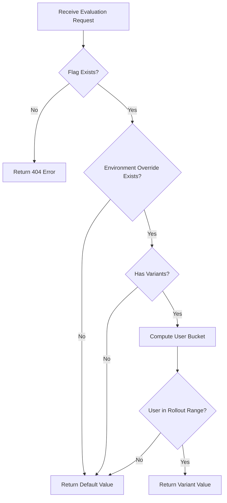

# Evaluation API

A high-performance, read-only Go API service for evaluating feature flags. This API is designed for SDK consumption with deterministic percentage-based rollouts and two-tier caching for optimal performance.

## Table of Contents

- [Overview](#overview)
- [API Endpoints](#api-endpoints)
- [Authentication](#authentication)
- [Evaluation Logic](#evaluation-logic)
- [Response Formats](#response-formats)
- [Error Handling](#error-handling)
- [Caching Architecture](#caching-architecture)
- [Best Practices](#best-practices)

---

## Overview

### Purpose

The Evaluation API provides fast, read-only access to feature flag evaluations. It's optimized for SDK consumption and designed to be called frequently by client applications to determine feature flag states.

### Key Characteristics

- **Read-Only**: No write operations - flag configuration is managed via Admin API
- **High Performance**: Sub-millisecond response times with aggressive caching
- **Deterministic Rollouts**: Percentage-based rollouts use MurmurHash3 for consistent user bucketing
- **Environment-Scoped**: Each API key is tied to a specific environment (production, staging, etc.)
- **Type-Safe Values**: Flags support BOOLEAN, STRING, and NUMBER types
- **Real-Time Invalidation**: Cache invalidation via Redis Pub/Sub ensures fresh data

### Architecture

```
SDK Client → Evaluation API → [L1 Memory Cache] → [L2 Redis Cache] → PostgreSQL
                                  ↓
                            Redis Pub/Sub (invalidation)
```

---

## API Endpoints

### Base URL

Development: `http://localhost:8081`  
Production: Set by deployment configuration

### Endpoint Summary

| Endpoint | Method | Purpose | Authentication |
|----------|--------|---------|----------------|
| `/health` | GET | Liveness check | None |
| `/ready` | GET | Readiness check | None |
| `/evaluate/{flagKey}` | GET | Evaluate single flag | API Key |
| `/evaluate` | GET | Evaluate all flags | API Key |

---

## Authentication

### API Key Authentication

All evaluation endpoints require authentication via environment API keys.

**Header:** `X-API-Key`

**Example:**
```http
GET /evaluate/new-feature HTTP/1.1
Host: localhost:8081
X-API-Key: env_prod_a1b2c3d4e5f6g7h8i9j0
```

### Obtaining API Keys

API keys are created via the Admin API when creating or managing environments. Each environment has a unique API key that scopes all flag evaluations to that environment's configuration.

### Security Considerations

- **API keys are sensitive**: Treat them like passwords
- **Server-side only**: Never expose API keys in client-side JavaScript
- **Environment isolation**: Each key only accesses its environment's flag values
- **Regeneration**: Keys can be regenerated via Admin API if compromised

---

## Evaluation Logic

### Flag Evaluation Process



### Percentage-Based Rollout

The API uses **MurmurHash3** for deterministic user bucketing:

1. **Combine identifiers**: `flagKey + ":" + userID`
2. **Hash to 32-bit**: `MurmurHash3(combined, seed=0)`
3. **Compute bucket**: `hash % 100` (yields 0-99)
4. **Match to variant**: Find variant where bucket < cumulative percentage

**Example:**

```
Flag: "new-checkout"
User: "user-123"
Combined: "new-checkout:user-123"
Hash: 2847139563
Bucket: 2847139563 % 100 = 63

Variants:
  - Variant A: 25% (buckets 0-24)
  - Variant B: 50% (buckets 25-74)
  
User bucket 63 falls in Variant B range → User gets Variant B
```

### Determinism Guarantees

- **Same user + same flag = same result**: Hash is deterministic
- **Different flags, different distribution**: Flag key is part of hash input
- **Consistent bucketing**: MurmurHash3 ensures uniform distribution
- **No drift over time**: Bucket calculation is stateless

### Default Values

A flag always has a default value (defined in flag configuration). The default is returned when:

- No environment-specific override exists
- Environment override has no variants
- User falls outside all variant percentages (e.g., total rollout < 100%)

---

## Response Formats

### Evaluate Single Flag

#### Request

```http
GET /evaluate/{flagKey}?user={userId} HTTP/1.1
Host: localhost:8081
X-API-Key: env_prod_a1b2c3d4e5f6g7h8i9j0
```

**Path Parameters:**
- `flagKey` (required): The flag's unique key (e.g., `new-checkout`)

**Query Parameters:**
- `user` (optional): User identifier for percentage rollout bucketing

#### Response (Success)

```json
{
  "flagKey": "new-checkout",
  "value": true,
  "type": "BOOLEAN",
  "isDefault": false,
  "variantId": "550e8400-e29b-41d4-a716-446655440000"
}
```

**Response Fields:**

| Field | Type | Description |
|-------|------|-------------|
| `flagKey` | string | The flag's key (same as request) |
| `value` | boolean/string/number | The evaluated value (typed correctly) |
| `type` | string | Flag type: `BOOLEAN`, `STRING`, or `NUMBER` |
| `isDefault` | boolean | `true` if default value is used, `false` if environment override |
| `variantId` | string (UUID) | Present only when environment variant is used (null if default) |

#### Type Examples

**Boolean Flag:**
```json
{
  "flagKey": "enable-dark-mode",
  "value": true,
  "type": "BOOLEAN",
  "isDefault": false,
  "variantId": "a1b2c3d4-..."
}
```

**String Flag:**
```json
{
  "flagKey": "theme-color",
  "value": "blue",
  "type": "STRING",
  "isDefault": false,
  "variantId": "e5f6g7h8-..."
}
```

**Number Flag:**
```json
{
  "flagKey": "max-items",
  "value": 100,
  "type": "NUMBER",
  "isDefault": true
}
```

**Note:** When `isDefault` is `true`, the `variantId` field will be `null` or omitted.

---

### Evaluate All Flags

#### Request

```http
GET /evaluate?user={userId} HTTP/1.1
Host: localhost:8081
X-API-Key: env_prod_a1b2c3d4e5f6g7h8i9j0
```

**Query Parameters:**
- `user` (optional): User identifier for percentage rollout bucketing

#### Response (Success)

```json
{
  "flags": {
    "new-checkout": {
      "flagKey": "new-checkout",
      "value": true,
      "type": "BOOLEAN",
      "isDefault": false,
      "variantId": "550e8400-e29b-41d4-a716-446655440000"
    },
    "max-items": {
      "flagKey": "max-items",
      "value": 100,
      "type": "NUMBER",
      "isDefault": true
    },
    "theme-color": {
      "flagKey": "theme-color",
      "value": "blue",
      "type": "STRING",
      "isDefault": false,
      "variantId": "deadbeef-dead-beef-dead-beefdeadbeef"
    }
  }
}
```

**Response Structure:**

```typescript
{
  flags: {
    [flagKey: string]: {
      flagKey: string;
      value: boolean | string | number;
      type: "BOOLEAN" | "STRING" | "NUMBER";
      isDefault: boolean;
      variantId?: string;  // UUID, present only when isDefault=false
    }
  }
}
```

**Behavior:**
- Only **active** flags are included
- Inactive flags are omitted from the response
- Empty object `{}` returned if no active flags exist

---

### Health Check

#### Request

```http
GET /health HTTP/1.1
Host: localhost:8081
```

**No authentication required.**

#### Response

```json
{
  "status": "ok"
}
```

**Status Code:** Always `200 OK`

**Purpose:** Kubernetes/Docker liveness probe to determine if the process is running.

---

### Readiness Check

#### Request

```http
GET /ready HTTP/1.1
Host: localhost:8081
```

**No authentication required.**

#### Response (Healthy)

```json
{
  "status": "ready"
}
```

**Status Code:** `200 OK`

#### Response (Unhealthy)

```json
{
  "status": "unavailable",
  "reason": "database connection failed"
}
```

**Status Code:** `503 Service Unavailable`

**Purpose:** Kubernetes/Docker readiness probe to determine if the API can serve traffic.

---

## Error Handling

### Error Response Format

All errors follow a consistent structure:

```json
{
  "error": "error_code",
  "message": "Human-readable error description"
}
```

### Error Codes

| Status | Error Code | Message | Cause |
|--------|------------|---------|-------|
| 400 | `bad_request` | Invalid request parameters | Missing or malformed request data |
| 401 | `unauthorized` | Invalid or missing API key | Missing `X-API-Key` header or invalid key |
| 404 | `not_found` | Flag not found | Flag key doesn't exist or is inactive |
| 500 | `internal_error` | Internal server error | Unexpected server error |
| 503 | N/A | Service unavailable | Readiness check failed (DB connection issues) |

### Error Examples

#### 401 Unauthorized

```http
HTTP/1.1 401 Unauthorized
Content-Type: application/json

{
  "error": "unauthorized",
  "message": "Invalid or missing API key"
}
```

**Causes:**
- Missing `X-API-Key` header
- Invalid or expired API key
- API key for inactive environment

#### 404 Not Found

```http
HTTP/1.1 404 Not Found
Content-Type: application/json

{
  "error": "not_found",
  "message": "Flag not found"
}
```

**Causes:**
- Flag key doesn't exist in database
- Flag exists but is marked inactive

#### 500 Internal Error

```http
HTTP/1.1 500 Internal Server Error
Content-Type: application/json

{
  "error": "internal_error",
  "message": "Internal server error"
}
```

**Causes:**
- Database query failure
- Cache connection failure
- Unexpected panic/crash (recovered)

### Error Handling in SDKs

**Recommended SDK behavior:**

1. **401 Unauthorized**: Log error, throw exception (configuration error)
2. **404 Not Found**: Return default value gracefully (flag doesn't exist yet)
3. **500/503 Errors**: Retry with exponential backoff, fallback to cached/default values
4. **Network Timeout**: Use circuit breaker pattern, fallback to local cache

---

## Caching Architecture

### Overview

The Evaluation API uses a **two-tier caching strategy** for optimal performance:

```
Request → L1 Memory Cache (30s TTL) → L2 Redis Cache (5m TTL) → PostgreSQL
```

### Cache Layers

| Layer | Storage | TTL | Latency | Scope |
|-------|---------|-----|---------|-------|
| **L1** | In-memory (Ristretto) | 30 seconds | < 1ms | Per-instance |
| **L2** | Redis | 5 minutes | 1-10ms | Shared across instances |
| **L3** | PostgreSQL | N/A | 10-50ms | Source of truth |

### Cached Data

The API caches:

1. **Environment by API Key**: `env:apikey:{key}` → Environment object
2. **Flag by Key**: `flag:key:{key}` → Flag object  
3. **Flag Value**: `flagvalue:{flagId}:{envId}` → FlagValue object
4. **Flag Variants**: `variants:{flagValueId}` → Array of variants
5. **All Active Flags**: `flags:active` → Array of all flags
6. **Environment Flags**: `flags:env:{envId}` → Map of flag key → flag value

### Cache Invalidation

**Redis Pub/Sub channels:**

- `cache:invalidate:env:{envId}` - Invalidate environment-specific caches
- `cache:invalidate:flag:{flagId}` - Invalidate specific flag caches
- `cache:invalidate:all` - Invalidate all caches (nuclear option)

**When invalidation occurs:**
- Admin API publishes invalidation messages on flag/environment changes
- All Evaluation API instances subscribe and clear relevant cache entries
- Next request repopulates cache from database

**SDK Implications:**
- Flag updates propagate within **30 seconds** (L1 TTL)
- Forced invalidation propagates **immediately** across all instances
- SDKs should expect eventual consistency

### Performance Characteristics

**Expected Latency:**

- **L1 Cache Hit**: < 1ms
- **L2 Cache Hit**: 1-5ms (local Redis)
- **L2 Cache Hit**: 5-10ms (remote Redis)
- **Cache Miss**: 10-50ms (database query)

**Cache Hit Ratios (typical):**

- L1 hit rate: 95-98%
- L2 hit rate: 98-99%
- Database queries: 1-2% of requests

---

## Best Practices

### API Usage

1. **Use Bulk Evaluation When Possible**
   - `GET /evaluate` is more efficient than multiple single flag requests
   - Reduces network overhead and authentication checks
   - Recommended for applications using multiple flags

2. **Pass User ID Consistently**
   - Always provide the same user identifier format
   - Ensures deterministic rollout bucketing
   - Generate stable IDs for anonymous users

3. **Implement Client-Side Caching**
   - Cache flag evaluations for 30-60 seconds
   - Significantly reduces API load
   - Provides fallback during API unavailability

4. **Handle Errors Gracefully**
   - Always have default flag values as fallback
   - Don't block application flow on API errors
   - Implement retry logic with exponential back off for 5xx errors

5. **Secure API Key Management**
   - Store API keys in environment variables or secrets managers
   - Never expose keys in client-side code
   - Rotate keys periodically
   - Use different keys for each environment

6. **Connection Management**
   - Reuse HTTP connections (keep-alive)
   - Set reasonable timeouts (5-10 seconds)
   - Close connections gracefully on shutdown

7. **Monitor Performance**
   - Track API response times
   - Monitor cache hit rates
   - Alert on elevated error rates
   - Watch for increased latency patterns

---

## HTTP Headers & CORS

### CORS Configuration

The API allows cross-origin requests:

```
Access-Control-Allow-Origin: *
Access-Control-Allow-Methods: GET, OPTIONS
Access-Control-Allow-Headers: Accept, Content-Type, X-API-Key
Access-Control-Max-Age: 86400
```

**Note:** While CORS is permissive (`*`), API keys should still be kept server-side only.

### Request Headers

**Required:**
```
X-API-Key: env_prod_a1b2c3d4e5f6g7h8i9j0
```

**Optional:**
```
Accept: application/json
User-Agent: MySDK/1.0.0
```

### Response Headers

```
Content-Type: application/json
X-Request-ID: unique-request-id
```

---

## Performance Expectations

### Latency Targets

| Scenario | Target Latency | Acceptable Latency |
|----------|----------------|-------------------|
| Cache hit (L1) | < 1ms | < 5ms |
| Cache hit (L2) | < 5ms | < 20ms |
| Cache miss (DB) | < 50ms | < 200ms |
| Bulk evaluation | < 10ms | < 50ms |

### Throughput

- **Single instance**: 10,000+ requests/second (with cache hits)
- **Horizontal scaling**: Linear scaling with multiple instances
- **Database bottleneck**: Minimize cache misses for best performance

---

## Changelog

### v1.0.0 (Current)
- Initial release
- Support for BOOLEAN, STRING, NUMBER flag types
- Percentage-based rollouts with MurmurHash3
- Two-tier caching (memory + Redis)
- Real-time cache invalidation via Pub/Sub
- Health and readiness endpoints
- CORS support

---
